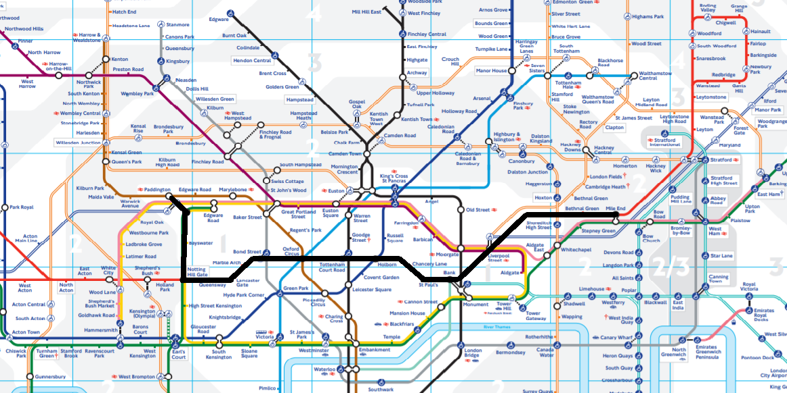

# London Underground Path Finder



This program outputs the shortest path between two stations and the appropriate train line(s),
using Dijkstra's algorithm. 

Example:
 
```$ javac Main.java```

```$ java Main "Mile End" Paddington```

Output:

```
"Mile End"

-----"Central Line"-----

"Bethnal Green"

"Liverpool Street"

"Bank"

"St. Paul's"

"Chancery Lane"

"Holborn"

"Tottenham Court Road"

"Oxford Circus"

"Bond Street"

"Marble Arch"

"Lancaster Gate"

"Queensway"

"Notting Hill Gate"

-----"District Line"-----

"Bayswater"

"Paddington"
```


Data source: https://github.com/nicola/tubemaps

