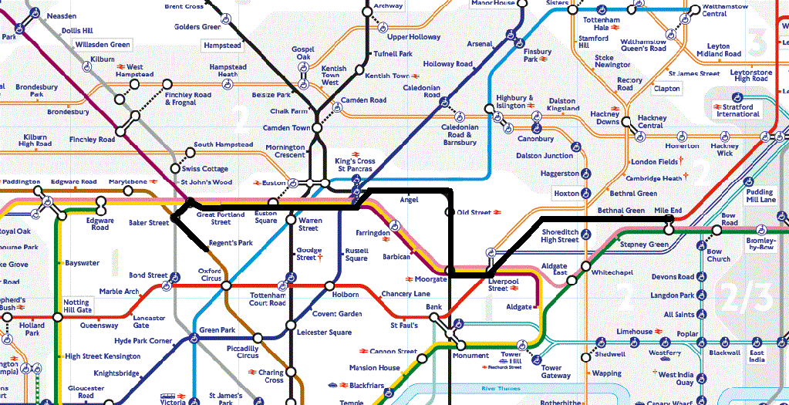

# London Underground Path Finder

This program outputs the shortest path between two stations and the appropriate train line(s),
using Dijkstra's algorithm.

Data source: https://github.com/nicola/tubemaps

